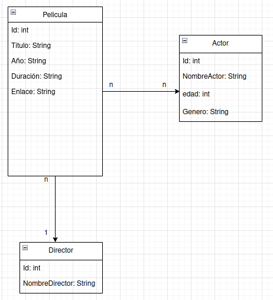

# Práctica Hibernate & JPA
En esta práctica, se aplicarán los conocimientos adquiridos durante el transcurso de la UF en el uso de Hibernate y JPA. Se realizarán consultas, gestión de resultados, modificaciones y procedimientos, además de gestionar transacciones y mensajes de error.

## Clases

    Actor: Representa a un actor en la base de datos.

    Director: Representa a un director en la base de datos.

    Pelicula: Representa a una película en la base de datos.

    PeliculaActor: Representa la relación entre películas y actores en la base de datos.

    DatabaseInitializer: Inicializa la base de datos y proporciona métodos para crear y manipular las tablas.

    ActorController: Controlador para la gestión de actores.

    DirectorController: Controlador para la gestión de directores.

    PeliculaController: Controlador para la gestión de películas.
## Relaciones

    Actor <-> Pelicula: Relación muchos a muchos. Un actor puede participar en varias películas y una película puede tener varios actores.
    Director <-> Pelicula: Relación uno a muchos. Un director puede dirigir varias películas, pero una película solo puede tener un director.

## Base de Datos

La base de datos utilizada contendrá tablas para almacenar información sobre actores, directores, películas y la relación entre actores y películas.

#### Esquema de base de datos con sus respectivas relaciones:

## Flujo de la Aplicación

    Se inicializa la base de datos utilizando el DatabaseInitializer.
    Se utilizan los controladores (ActorController, DirectorController y PeliculaController) para interactuar con la base de datos y realizar operaciones CRUD sobre las entidades.
    Se realizan consultas específicas para obtener información sobre actores, directores y películas, así como para realizar operaciones relacionales como buscar películas por actor o director.

Con esta práctica se busca aplicar los conocimientos teóricos de Hibernate y JPA en un proyecto práctico, gestionando de manera efectiva la persistencia de datos y las relaciones entre entidades en una base de datos relacional.

## Documentación JavaDoc
La documentación Javadoc para este proyecto está disponible [aquí](https://rababbm.github.io/Hibernate_Cine/doc/index.html)
